# UCS Monywa Information System - User App

[](https://www.android.com/)
[](https://www.oracle.com/java/)
[](https://android-arsenal.com/api?level=21)
[](LICENSE)

A comprehensive mobile application for **University of Computer Studies (UCS), Monywa** students and faculty to manage academic schedules, campus notices, exam results, and university activities. Built with modern Android development practices using Java 17, Firebase backend, and RESTful API integration.

---

## 📱 Features

### 🗓️ Timetable Management
- **Dynamic Timetable Display**: View class schedules organized by year (1st-5th) and section (A, B, C, D, E, CT)
- **Weekly Schedule View**: Interactive tabs for Monday through Friday with subject details
- **Subject Information**: Display subject name, instructor, duration, and timing
- **Persistent Selection**: Remembers selected year and section using SharedPreferences
- **Offline-First Architecture**: Cached data ensures availability without network

### 📢 Notice Board
- **Real-Time Updates**: Firebase Realtime Database integration for instant notice delivery
- **Rich Media Support**: Upload and display images with notice details
- **Timestamp Display**: Human-readable relative timestamps (e.g., "2 hours ago")
- **Detail View**: Full-screen notice viewing with image zoom capability
- **CRUD Operations**: Create, Read, Update, Delete notices (Admin functionality)

### 📊 Exam Results
- **Result Display**: Dedicated section for viewing examination results
- **Placeholder Ready**: Infrastructure prepared for result integration

### 🎯 Campus Activities
- **Event Management**: Track university events, workshops, and extracurricular activities
- **Firebase Integration**: Real-time event updates with image support
- **Event Details**: View comprehensive event information with dates and descriptions
- **Activity History**: Browse past and upcoming campus events

### ℹ️ About & Information
- **University Information**: Display UCS Monywa details and contact information
- **Developer Credits**: Application development and maintenance information

---

## 🏗️ Architecture

### **Clean Architecture Pattern**
```
┌─────────────────────────────────────────────────────────────┐
│                     Presentation Layer                       │
│  ┌──────────┐  ┌──────────┐  ┌──────────┐  ┌──────────┐   │
│  │MainActivity│  │Fragments │  │Activities│  │ Adapters │   │
│  └──────────┘  └──────────┘  └──────────┘  └──────────┘   │
└─────────────────────────────────────────────────────────────┘
                              ↓
┌─────────────────────────────────────────────────────────────┐
│                      Business Layer                          │
│  ┌──────────┐  ┌──────────┐  ┌──────────┐  ┌──────────┐   │
│  │  Models  │  │  Utils   │  │Constants │  │Preference│   │
│  └──────────┘  └──────────┘  └──────────┘  └──────────┘   │
└─────────────────────────────────────────────────────────────┘
                              ↓
┌─────────────────────────────────────────────────────────────┐
│                       Data Layer                             │
│  ┌──────────┐  ┌──────────┐  ┌──────────┐                  │
│  │Retrofit  │  │ Firebase │  │   Room   │                  │
│  │   API    │  │ Database │  │(Optional)│                  │
│  └──────────┘  └──────────┘  └──────────┘                  │
└─────────────────────────────────────────────────────────────┘
```

### **Key Architectural Decisions**

#### 1. **Centralized Constants Pattern**
All configuration values are managed through `constants/AppConstants.java`:
```java
public class AppConstants {
    public static class Api {
        public static final String BASE_URL = "http://192.168.100.72:3000/";
        public static final int CONNECT_TIMEOUT = 30;
        public static final int READ_TIMEOUT = 30;
        public static final int WRITE_TIMEOUT = 30;
    }
    
    public static class Firebase {
        public static final String NOTICEBOARD_PATH = "noticeboard";
        public static final String ACTIVITIES_PATH = "activities";
        public static final String STORAGE_IMAGES_PATH = "images/";
    }
    
    public static class Preferences {
        public static final String PREF_FILE_NAME = "com.internship.ucsmonywa";
        public static final String KEY_YEAR = "year";
        public static final String KEY_SECTION = "section";
    }
}
```

#### 2. **Year-Specific Model Structure (Intentional Duplication)**
- **5 Identical Model Packages**: `firstyear_model`, `secondyear_model`, `thirdyear_model`, `fourthyear_model`, `fifthyear_model`
- **No Inheritance**: Each package is self-contained with identical structure
- **Rationale**: Simplifies year-specific customization and maintains separation of concerns
- **Components per Year**:
  - `*YearData.java`: Wrapper class with Gson annotations
  - `Monday.java` - `Friday.java`: Weekday schedule containers
  - `SheduleItem.java`: Individual class/lecture details (subject, teacher, duration)
  - `*YearAdapter.java`: RecyclerView adapter for displaying schedules

#### 3. **Three-Layer API Integration**
```
┌─────────────────────────────────────────────────────────────┐
│  Layer 1: Constants (AppConstants.Api)                      │
│  - BASE_URL, Timeouts, Endpoints                            │
└─────────────────────────────────────────────────────────────┘
                              ↓
┌─────────────────────────────────────────────────────────────┐
│  Layer 2: Client (ApiClient.java - Singleton)               │
│  - Retrofit instance with OkHttpClient                      │
│  - Gson converter factory                                   │
│  - Lazy initialization                                      │
└─────────────────────────────────────────────────────────────┘
                              ↓
┌─────────────────────────────────────────────────────────────┐
│  Layer 3: Service (ApiInterface.java)                       │
│  - 25 endpoint methods (5 years × 5 sections)               │
│  - GET /{year}/{section} → Returns *YearData                │
└─────────────────────────────────────────────────────────────┘
                              ↓
┌─────────────────────────────────────────────────────────────┐
│  Layer 4: Access (ApiUtils.getApi())                        │
│  - Single entry point for all API calls                     │
└─────────────────────────────────────────────────────────────┘
```

#### 4. **Singleton Pattern for Shared State**
- **PreferenceManager**: Centralized SharedPreferences access
  ```java
  PreferenceManager prefManager = PreferenceManager.getInstance(context);
  prefManager.saveYear("firstyear");
  String year = prefManager.getYear();
  ```
- **ApiClient**: Single Retrofit instance for all network calls

---

## 🛠️ Technology Stack

### **Core Technologies**
| Technology | Version | Purpose |
|------------|---------|---------|
| **Java** | 17 (OpenJDK 17.0.16+) | Primary programming language |
| **Android SDK** | API 21-34 | Android platform support |
| **Gradle** | 8.4 | Build automation |
| **Android Gradle Plugin** | 8.2.2 | Android build configuration |

### **Libraries & Frameworks**

#### **UI & UX**
- **Material Design Components** (1.11.0): Modern UI components following Material Design guidelines
- **AndroidX AppCompat** (1.6.1): Backward compatibility for modern features
- **ConstraintLayout** (2.1.4): Flexible and performant layouts
- **RecyclerView**: Efficient list display with ViewHolder pattern
- **ViewPager**: Tab navigation for weekday schedules

#### **Networking**
- **Retrofit** (2.9.0): Type-safe HTTP client for REST API
- **Gson Converter** (2.9.0): JSON serialization/deserialization
- **OkHttp** (via Retrofit): HTTP client with connection pooling

#### **Backend Services**
- **Firebase BOM** (32.7.0): Unified Firebase SDK version management
  - **Firebase Realtime Database**: NoSQL cloud database for notices and activities
  - **Firebase Storage**: Cloud storage for images and media files
  - **Firebase Auth**: Authentication infrastructure (configured, not fully implemented)

#### **Image Processing**
- **Glide** (4.16.0): Efficient image loading and caching
  - Automatic memory management
  - Thumbnail generation
  - GIF support
  - Disk and memory caching

#### **Utilities**
- **PrettyTime** (5.0.7.Final): Human-readable timestamp formatting
- **Room Database** (2.6.1): Local SQLite abstraction (declared but not actively used)

#### **Testing**
- **JUnit** (4.13.2): Unit testing framework
- **Espresso** (3.5.1): UI testing framework
- **AndroidX Test Runner** (1.5.2): Test execution framework

---

## 📂 Project Structure

```
UCSMonywaInfo_User/
│
├── app/
│   ├── src/
│   │   ├── main/
│   │   │   ├── java/com/admin/ucsmonywa/
│   │   │   │   ├── activity/              # Activities
│   │   │   │   │   ├── MainActivity.java
│   │   │   │   │   ├── TimetableActivity.java
│   │   │   │   │   ├── NoticeBoardActivity.java
│   │   │   │   │   ├── Activities.java
│   │   │   │   │   ├── NoticeBoardDetail.java
│   │   │   │   │   ├── ActivityDetail.java
│   │   │   │   │   └── UpdateTimetable.java
│   │   │   │   │
│   │   │   │   ├── fragment/              # Fragments
│   │   │   │   │   ├── TimetableFragment.java
│   │   │   │   │   ├── NoticeBoardFragment.java
│   │   │   │   │   ├── ActivityFragment.java
│   │   │   │   │   ├── ResultFragment.java
│   │   │   │   │   ├── AboutFragment.java
│   │   │   │   │   ├── MondayFragment.java
│   │   │   │   │   ├── TuesdayFragment.java
│   │   │   │   │   ├── WednesdayFragment.java
│   │   │   │   │   ├── ThursdayFragment.java
│   │   │   │   │   └── FridayFragment.java
│   │   │   │   │
│   │   │   │   ├── adapter/               # RecyclerView Adapters
│   │   │   │   │   ├── FirstYearAdapter.java
│   │   │   │   │   ├── SecondYearAdapter.java
│   │   │   │   │   ├── ThirdYearAdapter.java
│   │   │   │   │   ├── FourthYearAdapter.java
│   │   │   │   │   ├── FifthYearAdapter.java
│   │   │   │   │   ├── NoticeBoardAdapter.java
│   │   │   │   │   └── ActivityAdapter.java
│   │   │   │   │
│   │   │   │   ├── model/                 # Data Models
│   │   │   │   │   ├── ImageUploadInfo.java
│   │   │   │   │   └── ActivityInfo.java
│   │   │   │   │
│   │   │   │   ├── firstyear_model/       # First Year Models
│   │   │   │   │   ├── FirstYearData.java
│   │   │   │   │   ├── Monday.java - Friday.java
│   │   │   │   │   └── SheduleItem.java
│   │   │   │   │
│   │   │   │   ├── secondyear_model/      # Second Year Models
│   │   │   │   ├── thirdyear_model/       # Third Year Models
│   │   │   │   ├── fourthyear_model/      # Fourth Year Models
│   │   │   │   ├── fifthyear_model/       # Fifth Year Models
│   │   │   │   │
│   │   │   │   ├── api/                   # API Layer
│   │   │   │   │   ├── ApiClient.java     # Retrofit singleton
│   │   │   │   │   └── ApiInterface.java  # API endpoints
│   │   │   │   │
│   │   │   │   ├── utils/                 # Utility Classes
│   │   │   │   │   ├── ApiUtils.java
│   │   │   │   │   ├── Utils.java
│   │   │   │   │   ├── PreferenceManager.java
│   │   │   │   │   └── ImageLoader.java
│   │   │   │   │
│   │   │   │   ├── constants/             # Application Constants
│   │   │   │   │   └── AppConstants.java
│   │   │   │   │
│   │   │   │   └── base/                  # Base Classes
│   │   │   │       ├── BaseActivity.java
│   │   │   │       └── BaseFragment.java
│   │   │   │
│   │   │   ├── res/                       # Resources
│   │   │   │   ├── layout/                # XML layouts
│   │   │   │   ├── drawable/              # Images and icons
│   │   │   │   ├── values/                # Strings, colors, styles
│   │   │   │   └── menu/                  # Navigation menu
│   │   │   │
│   │   │   └── AndroidManifest.xml        # App manifest
│   │   │
│   │   ├── androidTest/                   # Instrumented tests
│   │   └── test/                          # Unit tests
│   │
│   ├── build.gradle                       # Module build configuration
│   └── google-services.json               # Firebase configuration
│
├── gradle/                                 # Gradle wrapper
├── build.gradle                           # Project build configuration
├── settings.gradle                        # Project settings
├── .gitignore                             # Git ignore rules
└── README.md                              # This file
```

---

## 🚀 Getting Started

### **Prerequisites**

1. **Development Environment**:
   - Android Studio Hedgehog (2023.1.1) or later
   - JDK 17 (OpenJDK 17.0.16+ recommended)
   - Gradle 8.4+ (included via wrapper)

2. **Android SDK**:
   - Android SDK Platform 34 (Android 14)
   - Android SDK Build-Tools 34.0.0
   - Android SDK Platform-Tools
   - Android Emulator (optional, for testing)

3. **Firebase Setup**:
   - Firebase project with Realtime Database enabled
   - Firebase Storage bucket configured
   - `google-services.json` file (see Configuration section)

4. **Backend API** (Optional for timetable features):
   - Node.js backend API running on `http://192.168.100.72:3000/`
   - Or update `AppConstants.Api.BASE_URL` to your API endpoint

### **Installation Steps**

#### **1. Clone the Repository**
```bash
git clone https://github.com/eizonphyoe/UCSMonywaInfo_User.git
cd UCSMonywaInfo_User
```

#### **2. Configure Firebase**
1. Create a Firebase project at [Firebase Console](https://console.firebase.google.com/)
2. Add an Android app with package name: `com.admin.ucsmonywa`
3. Download `google-services.json` and place it in `app/` directory
4. Enable Firebase Realtime Database and Storage in Firebase Console
5. Set up database rules:
   ```json
   {
     "rules": {
       "noticeboard": {
         ".read": true,
         ".write": "auth != null"
       },
       "activities": {
         ".read": true,
         ".write": "auth != null"
       }
     }
   }
   ```

#### **3. Configure API Endpoint** (Optional)
Update the API base URL in `app/src/main/java/com/admin/ucsmonywa/constants/AppConstants.java`:
```java
public static class Api {
    public static final String BASE_URL = "http://your-api-url:3000/";
}
```

#### **4. Build the Project**
```bash
# Clean and build debug APK
./gradlew clean assembleDebug

# Install on connected device/emulator
./gradlew installDebug
```

#### **5. Run the Application**
- **Via Android Studio**: Click the "Run" button (Shift+F10)
- **Via Command Line**: 
  ```bash
  adb install app/build/outputs/apk/debug/app-debug.apk
  ```

---

## 🔧 Configuration

### **API Configuration**
Edit `constants/AppConstants.java`:
```java
public static class Api {
    public static final String BASE_URL = "http://192.168.100.72:3000/";
    public static final int CONNECT_TIMEOUT = 30; // seconds
    public static final int READ_TIMEOUT = 30;
    public static final int WRITE_TIMEOUT = 30;
}
```

### **Firebase Configuration**
Edit `constants/AppConstants.java`:
```java
public static class Firebase {
    public static final String NOTICEBOARD_PATH = "noticeboard";
    public static final String ACTIVITIES_PATH = "activities";
    public static final String STORAGE_IMAGES_PATH = "images/";
}
```

### **SharedPreferences Configuration**
```java
public static class Preferences {
    public static final String PREF_FILE_NAME = "com.internship.ucsmonywa";
    public static final String KEY_YEAR = "year";
    public static final String KEY_SECTION = "section";
}
```

### **Network Security Configuration**
For development with local API, cleartext traffic is enabled in `AndroidManifest.xml`:
```xml
<application
    android:usesCleartextTraffic="true">
```
**⚠️ Warning**: Disable this in production and use HTTPS endpoints.

---

## 🎯 API Endpoints

### **Timetable API**
Base URL: `http://192.168.100.72:3000/`

#### **Endpoint Structure**
```
GET /{year}/{section}
```

#### **Parameters**
- `year`: `firstyear`, `secondyear`, `thirdyear`, `fourthyear`, `fifthyear`
- `section`: `A`, `B`, `C`, `D`, `E`, `CT` (Computer Technology)

#### **Example Requests**
```http
GET /firstyear/A
GET /secondyear/CT
GET /fifthyear/D
```

#### **Response Format**
```json
{
  "monday": [
    {
      "subject": "Data Structures",
      "teacher": "Dr. John Doe",
      "duration": "9:00 AM - 11:00 AM"
    }
  ],
  "tuesday": [...],
  "wednesday": [...],
  "thursday": [...],
  "friday": [...]
}
```

#### **Total Endpoints**: 25 (5 years × 5 sections)

---

## 🗄️ Firebase Database Structure

### **Notice Board Node**
```
/noticeboard
  └── {pushId}
      ├── imageTitle: "Important Announcement"
      ├── imageDetail: "Exam schedule has been updated..."
      ├── image: "https://firebasestorage.googleapis.com/..."
      └── date: "2025-11-22T10:30:00Z"
```

### **Activities Node**
```
/activities
  └── {pushId}
      ├── activityTitle: "Tech Workshop"
      ├── activityDetail: "Workshop on Android Development..."
      ├── image: "https://firebasestorage.googleapis.com/..."
      └── date: "2025-11-25T14:00:00Z"
```

### **Firebase Storage Structure**
```
/images
  └── {timestamp}_{random}.jpg
```

---

## 🧪 Testing

### **Run Unit Tests**
```bash
./gradlew test
```

### **Run Instrumented Tests**
```bash
./gradlew connectedAndroidTest
```

### **Generate Test Coverage Report**
```bash
./gradlew jacocoTestReport
```

---

## 📦 Build Variants

### **Debug Build**
```bash
./gradlew assembleDebug
```
- Includes debugging symbols
- Logging enabled
- Network traffic visible in Logcat

### **Release Build**
```bash
./gradlew assembleRelease
```
- Code minification with ProGuard
- Optimized APK size
- Requires signing configuration

---

## 🐛 Troubleshooting

### **Common Issues**

#### **1. Firebase Initialization Error**
- **Problem**: `FirebaseApp initialization unsuccessful`
- **Solution**: Ensure `google-services.json` is in `app/` directory and matches package name

#### **2. API Connection Timeout**
- **Problem**: Network timeout when loading timetable
- **Solution**: 
  - Verify backend API is running
  - Check `BASE_URL` in `AppConstants`
  - Ensure device/emulator is on same network as API server

#### **3. Gradle Build Failure**
- **Problem**: `Could not find com.android.tools.build:gradle:8.2.2`
- **Solution**: Update Android Studio to latest version or modify `build.gradle` to use compatible version

#### **4. Image Upload Fails**
- **Problem**: Firebase Storage upload returns error
- **Solution**: 
  - Check Firebase Storage rules
  - Verify internet connectivity
  - Ensure Firebase Storage is enabled in console

#### **5. Clear Text Traffic Not Allowed**
- **Problem**: Network request blocked on Android 9+
- **Solution**: Add `android:usesCleartextTraffic="true"` to manifest (development only)

---

## 🔒 Security Considerations

### **Current Security Status**
⚠️ **This is a development/academic project with the following security considerations:**

1. **Cleartext HTTP**: API uses unencrypted HTTP (local development)
2. **Firebase Auth Not Implemented**: No user authentication for write operations
3. **Public Read Access**: Firebase database allows public read access
4. **Hardcoded Credentials**: API endpoint hardcoded in source

### **Production Recommendations**
For production deployment, implement:
- ✅ HTTPS/TLS for all API endpoints
- ✅ Firebase Authentication with proper rules
- ✅ API key management via Gradle secrets plugin
- ✅ ProGuard/R8 code obfuscation
- ✅ Certificate pinning for API calls
- ✅ Input validation and sanitization
- ✅ Secure storage for sensitive data

---

## 🚧 Known Limitations

1. **Exam Results**: UI prepared but data integration not implemented
2. **User Authentication**: Firebase Auth configured but login flow incomplete
3. **Offline Mode**: Limited offline support (only cached API responses)
4. **Push Notifications**: Not implemented
5. **Data Persistence**: Room database declared but not actively used
6. **Update/Delete Operations**: API endpoints support only GET requests
7. **Image Compression**: Original image sizes uploaded (no compression)

---

## 🗺️ Roadmap

### **Version 2.0 (Planned)**
- [ ] Complete Firebase Authentication implementation
- [ ] Push notifications for new notices/activities
- [ ] Offline-first architecture with Room database
- [ ] Exam result API integration
- [ ] User profile management
- [ ] Dark mode support
- [ ] Multi-language support (Myanmar/English)

### **Version 3.0 (Future)**
- [ ] Student attendance tracking
- [ ] Assignment submission module
- [ ] Faculty-student messaging
- [ ] Campus map integration
- [ ] Library book search
- [ ] GPA calculator

---

## 👨‍💻 Developer Information

### **Primary Developer**
**Ei Zon Phyoe**  
*Senior Android Developer*

- 📧 **Email**: [eieizonzon@gmail.com](mailto:eieizonzon@gmail.com)
- 📱 **Phone**: [+959787873678](tel:+959787873678)
- 💬 **WhatsApp**: [+959787873678](https://wa.me/959787873678)
- 📞 **Telegram**: [+959787873678](https://t.me/+959787873678)
- 📲 **Viber**: +959787873678

**Available for:**
- Android application development consulting
- Bug fixes and feature enhancements
- Code reviews and architecture guidance
- Firebase and backend integration
- Training and mentorship

**Working Hours**: Monday - Friday, 9:00 AM - 6:00 PM (Myanmar Time, UTC+6:30)

---

## 📄 License

This project is developed as part of a final year internship project at University of Computer Studies, Monywa (2019).

### **MIT License**

```
MIT License

Copyright (c) 2019-2025 Ei Zon Phyoe

Permission is hereby granted, free of charge, to any person obtaining a copy
of this software and associated documentation files (the "Software"), to deal
in the Software without restriction, including without limitation the rights
to use, copy, modify, merge, publish, distribute, sublicense, and/or sell
copies of the Software, and to permit persons to whom the Software is
furnished to do so, subject to the following conditions:

The above copyright notice and this permission notice shall be included in all
copies or substantial portions of the Software.

THE SOFTWARE IS PROVIDED "AS IS", WITHOUT WARRANTY OF ANY KIND, EXPRESS OR
IMPLIED, INCLUDING BUT NOT LIMITED TO THE WARRANTIES OF MERCHANTABILITY,
FITNESS FOR A PARTICULAR PURPOSE AND NONINFRINGEMENT. IN NO EVENT SHALL THE
AUTHORS OR COPYRIGHT HOLDERS BE LIABLE FOR ANY CLAIM, DAMAGES OR OTHER
LIABILITY, WHETHER IN AN ACTION OF CONTRACT, TORT OR OTHERWISE, ARISING FROM,
OUT OF OR IN CONNECTION WITH THE SOFTWARE OR THE USE OR OTHER DEALINGS IN THE
SOFTWARE.
```

---

## 🤝 Contributing

While this is primarily an academic project, contributions are welcome!

### **How to Contribute**

1. **Fork the Repository**
   ```bash
   git clone https://github.com/eizonphyoe/UCSMonywaInfo_User.git
   ```

2. **Create Feature Branch**
   ```bash
   git checkout -b feature/your-feature-name
   ```

3. **Commit Changes**
   ```bash
   git add .
   git commit -m "feat: add your feature description"
   ```

4. **Push to Branch**
   ```bash
   git push origin feature/your-feature-name
   ```

5. **Open Pull Request**
   - Describe your changes
   - Reference any related issues
   - Add screenshots for UI changes

### **Contribution Guidelines**
- Follow existing code style and architecture patterns
- Write meaningful commit messages (Conventional Commits preferred)
- Add unit tests for new features
- Update documentation for API changes
- Test on multiple Android versions (API 21-34)

---

## 📞 Support

### **Need Help?**

1. **Check Documentation**: Review this README and `.github/copilot-instructions.md`
2. **Search Issues**: Look for similar problems in [GitHub Issues](https://github.com/eizonphyoe/UCSMonywaInfo_User/issues)
3. **Create Issue**: Open a new issue with detailed description and logs
4. **Contact Developer**: Reach out via email or messaging platforms listed above

### **Reporting Bugs**
When reporting bugs, please include:
- Android version and device model
- Steps to reproduce the issue
- Expected vs actual behavior
- Logcat output (if applicable)
- Screenshots or screen recordings

---

## 🙏 Acknowledgments

- **University of Computer Studies, Monywa** - For providing the opportunity and resources
- **Firebase Team** - For excellent backend infrastructure
- **Android Development Community** - For libraries and best practices
- **Square Inc.** - For Retrofit and OkHttp libraries
- **Bump Technologies** - For Glide image loading library

---

## 📊 Project Statistics

- **Total Lines of Code**: ~15,000+
- **Number of Activities**: 7
- **Number of Fragments**: 10
- **Number of Adapters**: 7
- **Model Classes**: 35+ (including year-specific models)
- **Minimum Supported Android**: API 21 (Android 5.0 Lollipop)
- **Target Android**: API 34 (Android 14)
- **Development Period**: 2019 - 2025 (Maintained)

---

## 📱 Screenshots

### Application Overview

<div align="center">

#### Main Navigation & Timetable Selection
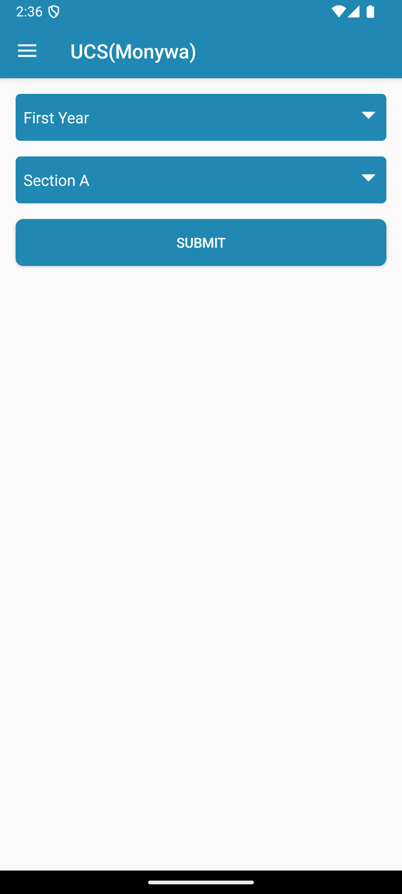 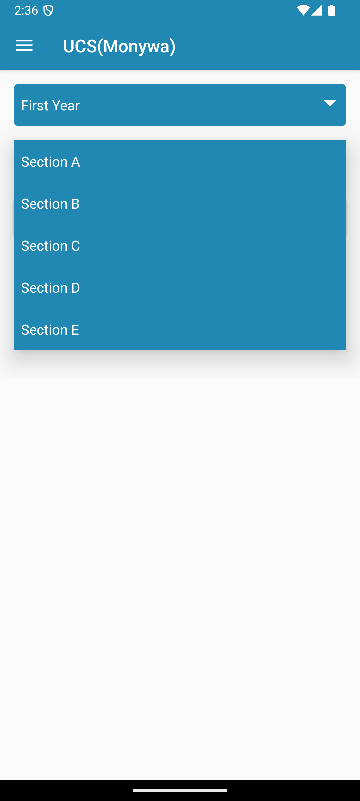 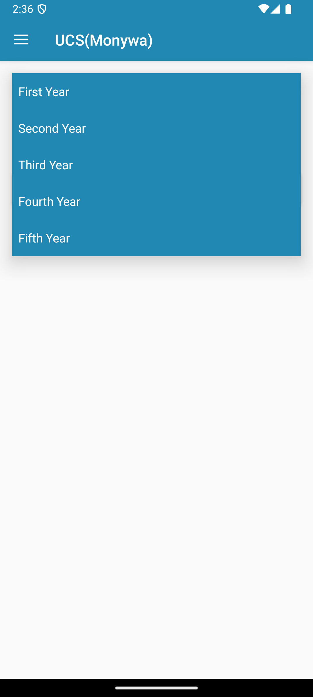

#### Timetable Display & Weekly Schedule
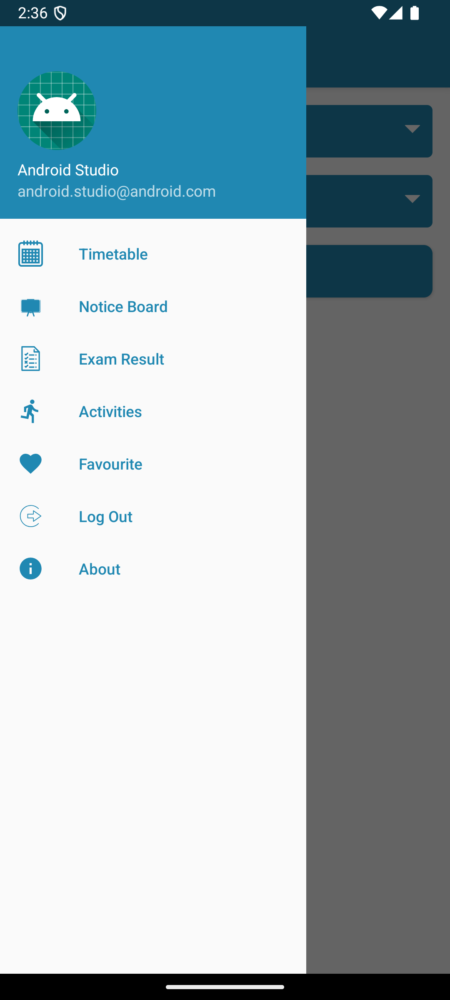 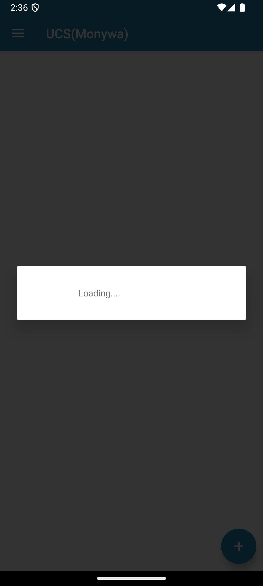 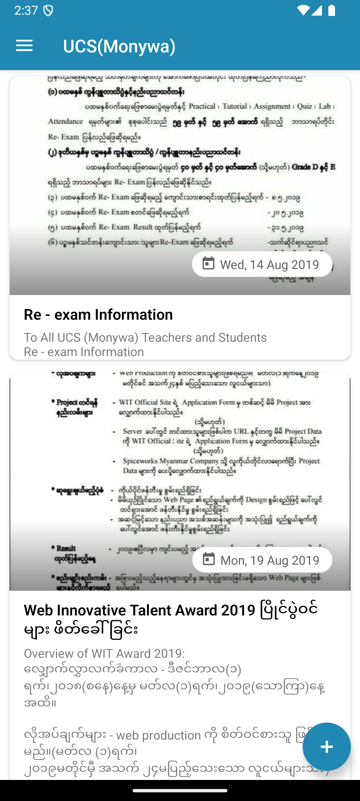

#### Notice Board & Activities
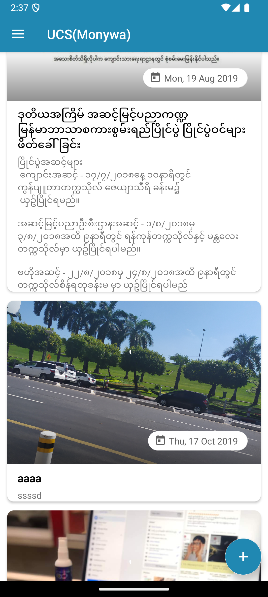 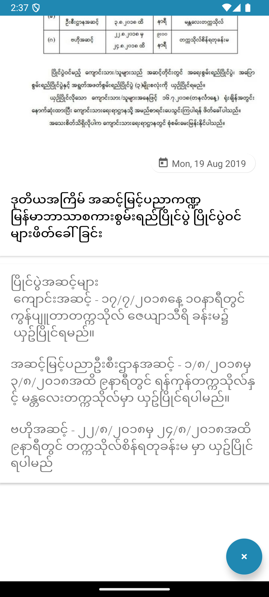 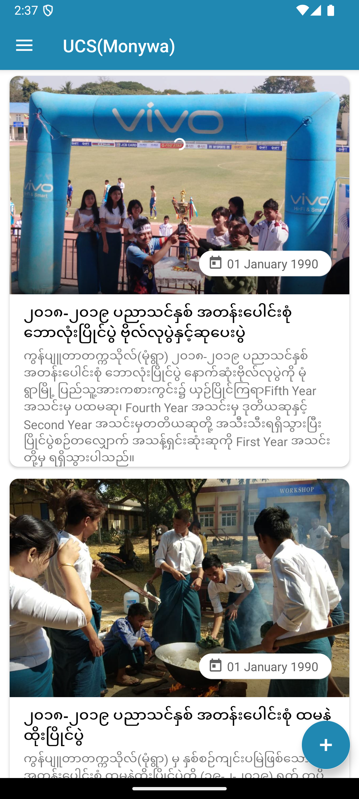

#### Additional Features
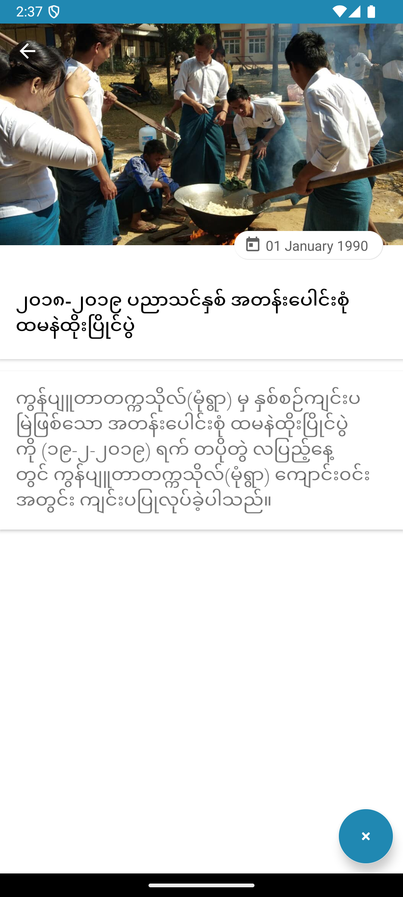 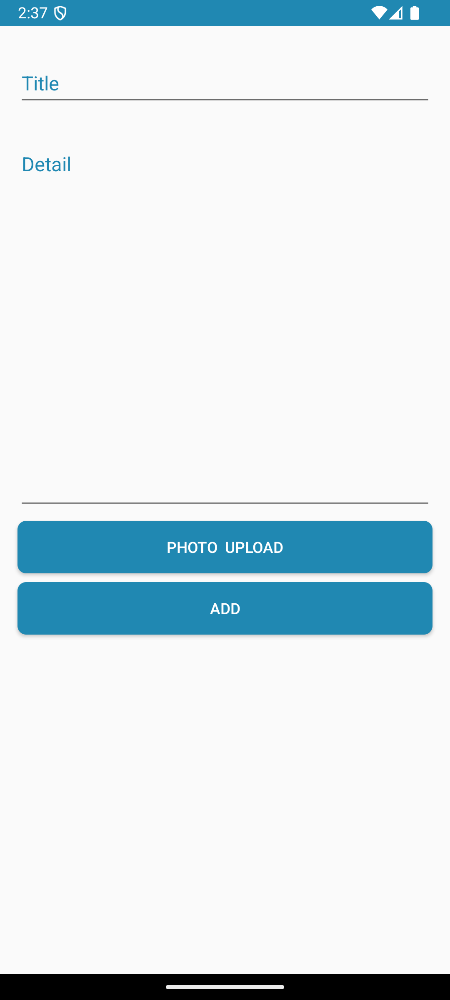

</div>

### Key Features Demonstrated:
- ✅ **Intuitive Navigation**: Material Design navigation drawer
- ✅ **Timetable Management**: Year and section selection with weekly schedule view
- ✅ **Notice Board**: Firebase-powered real-time notices with image support
- ✅ **Campus Activities**: Event tracking and information display
- ✅ **Exam Results**: Dedicated section for result viewing
- ✅ **Clean UI**: Modern Material Design following Android best practices

---

## 🔗 Related Projects

- **UCS Monywa Admin App**: Admin panel for managing notices and activities
- **UCS Monywa Backend API**: Node.js REST API for timetable data

---

<div align="center">

**Made with ❤️ for UCS Monywa Students**

[⬆ Back to Top](#ucs-monywa-information-system---user-app)

</div>
